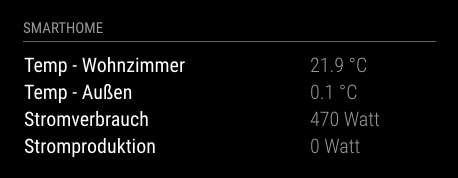

**WORK IN PROGRESS**

## SmartHome.py@MagicMirror 

Small Module to display values from [SmartHome.py](https://mknx.github.io/smarthome/) (using the Visu plug-in) on your [MagicMirror](https://github.com/MichMich/MagicMirror).



### Installation

Clone the module into the modules directory of your MagicMirror installation and run `npm install`.

### Configuration

```
{
	header: "Smarthome",
	position: 'top_left',
	module: 'magic-mirror-smarthomepy',
	config: {
		host: '192.168.1.11', // Host of your SmartHome.py installation
		port: '2121', // Port of your SmartHome.py installation the WebSocket of the Visu plug-in is listing to
		items: [
			{ name: 'Temp - Living room', unit: '°C', item: 'livingroom.temp.value' },
			{ name: 'Temp - Outside', unit: '°C', item: 'outside.temp.value', formatFunction: function(val) { return Math.floor(val);}},
			{ name: 'Power consumption', unit: 'Watt', item: 'power.total.consumption' }
		]
	}
}
```


